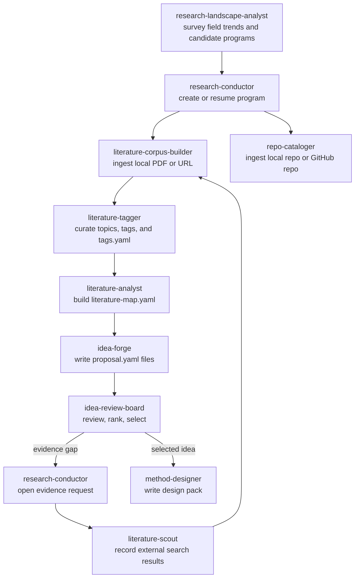

# Research Workflow

## Core Principle

所有 skill 通过共享文件系统协作，事实源以 `doc/research/` 为准，聊天上下文不是唯一状态源。

共享约束再收紧一层：

- specialist skill 完成自己的主产物后，应同步更新 `workflow/state.yaml`
- `research-conductor` 负责纠偏、补记 durable decision、open question 和 preference
- 非 canonical 外部证据只能停留在 `library/search/results/`，直到 `literature-corpus-builder` 完成入库
- YAML 产物默认要带可追溯的 `inputs`
- research v1.1 skill 在读取共享 YAML 前，应先确认当前 Python 运行时具备 `PyYAML`；涉及 PDF 解析的 skill 还要确认 `PyPDF2` 或 `pypdf`
- 已验证可用的解释器应记到 `memory/runtime-environments.yaml`，并优先通过 remembered runtime 运行高风险 skill
- 研究主题相关的 heuristic 统一放到 `memory/domain-profile.yaml`，不要在 skill 脚本里继续 hardcode 当前方向的关键词

## End-to-End Flow

可视化浏览是贯穿式可选层：

- 当用户需要“把当前 shared library 和 program 产物变成人类可读网页”时，调用 `research-kb-browser`
- `research-kb-browser` 读取 canonical library 和 program artifacts，但不改变它们
- 它的输出默认位于 `doc/research/user/kb/`，并可通过本地 daemon 在后台自动刷新

## File Handoff Rules

### Research Conductor
- owns: `charter.yaml`, `workflow/*`, `memory/*`
- can instantiate from: `library/landscapes/<survey-id>/landscape-report.yaml`
- should not write: `proposal.yaml`, `review.yaml`, `repo summaries`

### Literature Corpus Builder
- owns: `library/literature/*`, `intake/papers/*`
- receives from: `raw/`, explicit links, `literature-scout`
- hands off to: `literature-tagger`, `literature-analyst`

### Literature Tagger
- owns: tag or topic curation in `library/literature/*/metadata.yaml` plus `library/literature/tags.yaml` and `library/literature/tag-taxonomy.yaml`
- receives from: `literature-corpus-builder`, explicit curation requests
- hands off to: `literature-analyst`

### Research Landscape Analyst
- owns: `library/landscapes/*`
- receives from: explicit field or direction requests plus the shared literature/repo library
- hands off to: `research-conductor`

### Research KB Browser
- owns: `user/kb/*`, `user/kb/.runtime/*`
- receives from: shared library, memory profile, and existing program artifacts
- hands off to: the human user; it is a read-only visualization layer rather than a downstream research fact source
- guardrail: never mutate canonical research yaml from the browser or its local server api

### Repo Cataloger
- owns: `library/repos/*`, `intake/repos/*`
- receives from: local repo paths, GitHub URLs
- hands off to: `idea-forge`, `method-designer`

### Idea Forge
- owns: `ideas/<idea-id>/proposal.yaml`
- receives from: `charter.yaml`, `literature-map.yaml`, optional repo index
- hands off to: `idea-review-board`

### Idea Review Board
- owns: `review.yaml`, `decision.yaml`, `workflow/evidence-requests.yaml`
- receives from: `proposal.yaml`, `literature-map.yaml`, optional search results
- hands off to: `research-conductor` or `method-designer`
- guardrail: default to collaborative review and user confirmation; only write an explicit `selected` decision when the user clearly asks for automatic selection

### Method Designer
- owns: `design/*`, `experiments/*`
- receives from: selected idea files and repo library
- hands off to: later coding / experiment execution agents
- guardrail: refuse unselected ideas by default, and write cross-repo coordination artifacts when the design spans multiple repos

## Workflow State Ownership

`workflow/state.yaml` 不是只给 `research-conductor` 用的静态记录，而是各阶段的共享进度条。

- `research-conductor`：初始化 program，维护 `problem-framing`，并在人工纠偏时覆盖 stage
- `literature-analyst`：写完 `evidence/literature-map.yaml` 后推进到 `literature-analysis`
- `idea-forge`：写完 proposal 和 `ideas/index.yaml` 后推进到 `idea-generation`
- `idea-review-board`：评审时推进到 `idea-review`；确定唯一选中项后推进到 `method-design`
- `method-designer`：写完 design pack 后推进到 `implementation-planning`

字段解释：

- `active_idea_id`：当前 workflow 正在聚焦的 idea；如果还在并行发散多个候选，可留空
- `selected_idea_id`：已经被明确选中的 idea
- `selected_repo_id`：已经被 design 阶段选中的 canonical repo

阶段切换 guardrail：

- 没有 `selected_idea_id` 时，不应把 stage 推到 `method-design` 之后
- `idea-review-board` 可以读取 search results 作为 staging evidence，但不能把它当成 canonical literature
- 如果某个 skill 只是补充旧产物而不是改变主阶段，应保留现有 selection 字段，不要无意清空

## External Search Interface

外网知识注入是可选接口，不是默认前提。

触发条件：
- 用户明确要求“最新”“帮我搜索”“检查 novelty”
- `idea-review-board` 发现 evidence gap
- 本地 library 缺少支撑当前决策所需的关键证据

约束：
- `literature-scout` 只能记录搜索结果到 `library/search/results/`
- 任何外部文献要进入正式知识库，都必须经过 `literature-corpus-builder`
- `idea-review-board` 不能跳过这一步直接把外部搜索结果当 canonical evidence

推荐交接：

- `idea-review-board` 或 `research-conductor` 先在 `workflow/evidence-requests.yaml` 里记录 why now
- `literature-scout` 在搜索结果里保留 query、candidate URL 和 program 上下文
- `literature-corpus-builder` 只 ingest 已 shortlist 的 URL，避免把搜索日志直接变成 library
- 如果后续会依赖 tag 聚类或 topic-based 检索，入库后补跑一次 `literature-tagger`
- 当 tags 开始出现别名、大小写漂移或 paper-local 命名时，先补 `tag-taxonomy.yaml` 再做 `taxonomy-apply`

## Duplicate Review Loop

### Literature duplicate loop
1. `literature-corpus-builder` 先做 exact match
2. 再做 fuzzy match
3. fuzzy 命中时写 `intake/papers/review/pending.yaml`
4. `research-conductor` 在对话中确认归并或新建
5. `literature-corpus-builder` 根据确认结果更新 canonical 条目

### Repo duplicate loop
1. `repo-cataloger` 先做 exact match
2. 再做 fuzzy match
3. fuzzy 命中时写 `intake/repos/review/pending.yaml`
4. `research-conductor` 在对话中确认归并或新建
5. `repo-cataloger` 根据确认结果更新 canonical repo

## Memory And Preferences Loop

- 长期偏好写入 `doc/research/memory/`
- 已验证可用的 research Python runtime 写入 `doc/research/memory/runtime-environments.yaml`
- workspace 当前研究主题的短词、tag 规则、repo role 规则写入 `doc/research/memory/domain-profile.yaml`
- 课题局部偏好写入 `programs/<program-id>/workflow/preferences.yaml`
- `research-conductor` 负责把聊天中明确稳定的偏好落地为文件
- 其他 skill 默认只读取 memory 或提出建议，不直接写全局 memory

## Artifact Contract

所有 YAML handoff 文件默认满足：

- 顶层保留 `id`、`status`、`generated_by`、`generated_at`、`inputs`、`confidence`
- 若包含推理内容，优先使用 `Observed`、`Inferred`、`Suggested`、`OpenQuestions`
- 若引用 library 中的实体，优先写稳定 ID，再补具体路径
