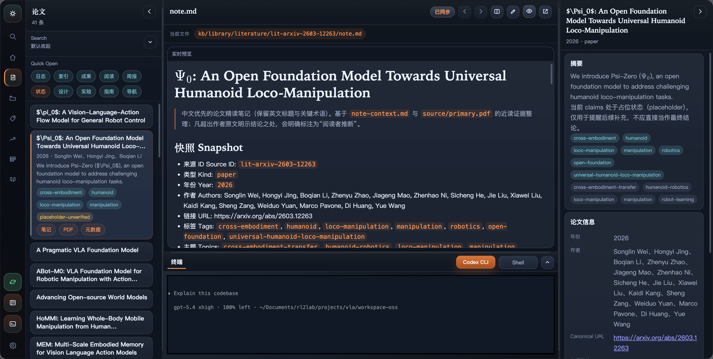

# Open Research Workspace Skills



这是一个开源的 research workspace 骨架。

它不是现成知识库，而是一套让 Codex 持续维护科研工作区的规则、技能和文档。目标很简单：把论文、网页、仓库、idea、设计、实验记录和周报，尽量从聊天里搬到可复用的工作区文件里。

这个仓库主要公开三层：

- `.agents/`：skills、脚本、共享运行库
- `AGENTS.md`：工作区 schema 和写作规则
- `docs/`：上手说明、skill 说明、发布说明

如果本地还没有 `kb/`，也没关系。这个仓库可以先只作为 workflow 和技能系统使用，知识库内容之后再在本地生成。

## Start Here

- [Getting Started](docs/GETTING_STARTED.md)
- [Skills Guide](docs/SKILLS_GUIDE.md)
- [Publishing Notes](docs/PUBLISHING.md)
- [LLM Wiki Pattern](docs/llm-wiki.md)

## The Idea

这套 workspace 的默认目录是：

```text
kb/
├── intake/
├── library/
├── programs/
├── wiki/
├── user/
└── memory/
```

可以把它粗略理解成：

- `library/`：资料入库
- `programs/`：具体研究方向
- `wiki/`：全局查询、索引、日志
- `user/`：人类入口页

## Minimal Usage

多数时候你不需要复杂 prompt。

下面这种一句话通常就够了：

```text
请先读取当前状态，判断我现在最该做哪一步，并直接执行。
```

如果你已经知道对象，也可以再补一行：

```text
program_id=<your-program-id>
```

如果你知道自己想显式调用哪个 skill，也可以直接点名：

```text
请用 $literature-analyst 为 <program-id> 刷新 literature map。
```

文献/repo入库：

```text
<论文链接>/<仓库链接>入库。
```

打开工作台：

```text
打开工作台。
```

## Notes

- 发布版文档默认使用 `kb/` 路径。
- 工作区鼓励中文优先的人类可读产物。
- 高价值结果尽量落到文件里，而不是只留在聊天里。
