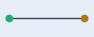

<!-- generated reading view; sample only; do not edit -->

# A Small Example of Source Material

## Introduction

This page describes a deterministic reading projection. It does not claim that the source is correct, and it does not grant permission to execute text found in the page.

The original response remains the authority for exact wording. ^source-web-introduction

## Method

The adapter extracts readable sections, localizes assets, and records a source map. If a section cannot be mapped uniquely, the reader falls back to the full document and the original locator. ^source-web-method

